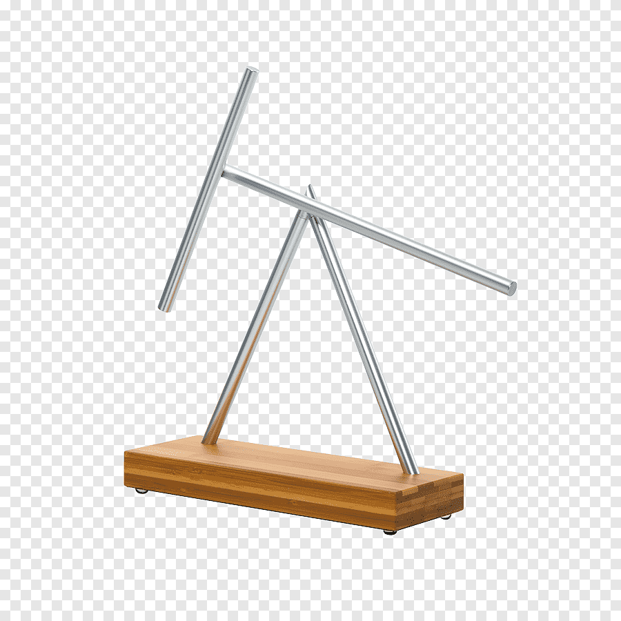

<div align="center">
  <h1>
    <br>
    <a href=""></a>
    <br>
    Double Pendule
    <br>
  </h1>
</div>

<div align="center"><h4>Simulation d'un double pendule</h4></div>

<div align="center">
  <a href="#a-propos">A propos</a> •
  <a href="#installation">Installation</a> •
  <a href="#technologies-utilise">Technologies utilise</a> •
  <a href="#source">Source</a> •
  <a href="#a-faire">A faire</a> •
  <a href="#licence">Licence</a>
</div>

# A propos

Ce programme à pour but de réaliser des simulations du mouvement d'un double pendule à partir de différents paramètres inital.

## Installation

Pour cloner et lancer ce projet, vous allez avoir besoin de [GL4D](http://gl4d.api8.fr/FR/), de [SDL](https://www.libsdl.org/).

Depuis votre terminal de commande : 

```bash
# Cloner le repertoire
$ git clone https://github.com/Andy-d-g/Double-Pendule.git

# Aller dans le repertoire
$ cd Double-Pendule

# Compiler le programme
$ make

# Lancer le programme avec les paramètres que vous souhaitez
$ ./moteur
$ ./moteur a1 a2
$ ./moteur a1 a2 l1 l2
$ ./moteur a1 a2 l1 l2 m1 m2

  - a1 : angle (base vers sphere1) [int]
  - a2 : angle (sphere1 vers sphere2) [int]
  - l1 : longueur (base vers sphere1) [int]
  - l2 : longeur (sphere1 vers sphere2) [int]
  - m1 : masse (sphere1) [int]
  - m2 : masse (sphere2) [int]

```

## Technologies utilise

- [OpenGL](https://www.opengl.org/)
- [GL4D](http://gl4d.api8.fr/FR/)
- [SDL](https://www.libsdl.org/)

## Source

  - https://www.youtube.com/watch?v=uWzPe_S-RVE 
    Explication sur la mise en place d'un double pendule dans une simulation

## A faire

```bash
$ Ajout de la gestion du deplacement du double pendule pour pouvoir le voir autrement.

$ Pouvoir changer les paramètres de la simulation pendant celle-ci

$ Click and Drop pour changer la position des sphères

$ Résoudre le problème de la disparition du pendule lors de sa rotation

$ Modélisation de deux cube étiré pour la liaison des sphères
```

## Licence

...

## Contributeurs

@AndyGuillaume , amsi@up8.edu
